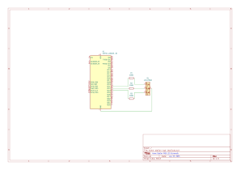

# Home Weather Station

In this project, we will build a simple home weather station using the ESP32 microcontroller and DHT11 temperature and humidity sensor. This project is built on the **PlatformIO platform** using the **ESP-IDF framework**, providing a professional development environment with advanced debugging and project management capabilities.

The project allows you to monitor the temperature and humidity in your home and display the data on a web page. We will also have a simple web server with a simple interface that will allow us to update the firmware over the air (OTA).

## Table of Contents

- [Components Required](#components-required)
- [Part 1: RGB LED Control](#part-1-rgb-led-control)
- [Part 2: WiFi - SoftAp](#part-2-wifi---softap)
  - [Task Configuration (`tasks_common.h`)](#tasks_commonh---common-task-configuration)
  - [RGB LED Control Logic (`rgb_led.c` and `rgb_led.h`)](#rgb_ledc-and-rgb_ledh---rgb-led-control-logic)
  - [WiFi Application Logic (`wifi_app.c` and `wifi_app.h`)](#wifi_appc-and-wifi_apph---wifi-application-logic)
- [Part 3: HTTP Server](#http_serverc-and-http_serverh---http-server-logic)
- [Part 4: DHT11 Temperature and Humidity Sensor](#part-4-dht11-temperature-and-humidity-sensor)
- [Part 5: Web Interface Files](#part-5-web-interface-files)
- [Project Summary](#project-summary)

## Components Required

- ESP32 development board
- DHT11 temperature and humidity sensor
- Jumper wires
- Breadboard (optional)
- USB cable for programming the ESP32

## Part 1: RGB LED Control

### Wiring Diagram



### Code 

1. `rgb_led.h`

   - This header contains the definitions for the RGB LED GPIO pins and the channel number.

   ```c
   // RGB LED GPIOs
    #define RGB_LED_RED_GPIO 21
    #define RGB_LED_GREEN_GPIO 22
    #define RGB_LED_BLUE_GPIO 23

    // RGB LED color mix channel
    #define RGB_LED_CHANNEL_NUM 3
   ```

   - This header also contains the structure definition for the RGB LED configuration and blink parameters.

   ```c
   // BLINK parameters
   #define RED_BLINK_ON_DUTY   255
   #define RED_BLINK_OFF_DUTY  0
   #define RED_BLINK_DELAY_MS  1000

   // RGB LED configuration
   typedef struct {
       int channel;
       int gpio;
       int mode;
       int timer_index;
   } ledc_info_t;
   ```

#### Event Handling

- **`wifi_app_event_handler(void *arg, esp_event_base_t event_base, int32_t event_id, void *event_data)`**:
  Handles WiFi and IP events. Logs event types such as AP start/stop, station connect/disconnect, and IP acquisition. Can be extended to trigger additional actions (e.g., LED updates or queue messages) based on event type.
- **`wifi_app_event_handler_init()`:**
  Registers the event handler for both WiFi and IP events using ESP-IDF's event system. Ensures all relevant events are captured and processed by the application.

#### WiFi Initialization and Configuration

- **`wifi_app_default_wifi_init()`:**
  Initializes the TCP/IP stack and configures the default WiFi settings. Creates network interfaces for both station and access point modes, preparing the ESP32 for dual-mode operation.
- **`wifi_app_soft_ap_config()`:**
  Configures the ESP32 as a WiFi SoftAP (Access Point). Sets up the SSID, password, channel, visibility, authentication mode, and beacon interval. Assigns a static IP, gateway, and netmask, and starts the DHCP server for client devices.

#### Task and Queue Management

- **`wifi_app_task(void *pvParameters)`:**
  The main FreeRTOS task for the WiFi application. Initializes event handling, network stack, and SoftAP configuration, then starts the WiFi driver. Sends an initial message to start the HTTP server. Enters a loop to process messages from the queue, handling events such as HTTP server start, connection attempts, and successful connections (with corresponding LED updates).
- **`wifi_app_send_message(wifi_app_message_e msgID)`:**
  Sends a message to the WiFi application's FreeRTOS queue. Used for asynchronous, event-driven communication between different parts of the application (e.g., from event handlers to the main task).
- **`wifi_app_start()`:**
  Entry point for starting the WiFi application. Sets the initial LED color, disables default WiFi logging, creates the message queue, and starts the main WiFi application task pinned to a specific core.

### Message Types

The WiFi application uses the following message types for inter-task communication:

```c
typedef enum wifi_app_message
{
    WIFI_APP_MSG_START_HTTP_SERVER = 0,         ///< Request to start HTTP web server
    WIFI_APP_MSG_CONNECTING_FROM_HTTP_SERVER,   ///< WiFi connection initiated from web interface
    WIFI_APP_MSG_STA_CONNECTED_GOT_IP,          ///< Station mode connected and received IP address
} wifi_app_message_e;
```

### Network Interface Management

The WiFi application manages two network interfaces:

- **`esp_netif_sta`**: Network interface handle for Station mode (connecting to external WiFi)
- **`esp_netif_ap`**: Network interface handle for Access Point mode (creating WiFi hotspot)

### Design Notes

- Implements a dual-mode WiFi system supporting both AP and Station modes simultaneously
- Uses FreeRTOS queues for thread-safe inter-task communication
- Provides visual feedback through RGB LED for different WiFi states
- Includes comprehensive error handling and event logging
- Configured for optimal performance on ESP32 dual-core architecture

#### Static Helper Functions

- **`rgb_led_pmw_init(void)`:**
  Initializes the LEDC (LED Controller) peripheral for PWM-based color mixing. Configures timer and channels for RGB control.

- **`rgb_led_set_color(uint8_t red, uint8_t green, uint8_t blue)`:**
  Sets the RGB LED color using 8-bit values (0-255) for each color channel.

- **`red_led_task(void *pvParameters)`:**
  FreeRTOS task that creates a blinking red LED pattern for error indication. Toggles red LED on/off with configurable delay.

### LED Status Indicators

The RGB LED provides visual feedback for different system states:

- **Magenta/Purple**: WiFi application started
- **Orange**: HTTP server started  
- **Green**: WiFi connected successfully
- **Teal**: DHT11 sensor initialized
- **Blinking Red**: System error detected
- **Light Blue**: DHT11 sensor reading in progress


## Part 2: WiFi - SoftAp

## `tasks_common.h` - Common Task Configuration

The `tasks_common.h` header file centralizes all FreeRTOS task configuration parameters for the ESP32 weather station project. This design approach makes it easier to tune system performance and manage task scheduling across all application components.

### Key Features

- **Centralized Configuration**: All task priorities, stack sizes, and core assignments in one location
- **Priority Guidelines**: 
  - Higher numbers = Higher priority (0 = lowest, configMAX_PRIORITIES-1 = highest)
  - Critical tasks: 5-7, Normal tasks: 2-4, Background tasks: 0-1
- **Core Assignment Strategy**:
  - Core 0: Protocol tasks (WiFi, networking, HTTP server)
  - Core 1: Application tasks (sensors, processing)

### Task Configuration Constants

```c
// WiFi Application Task Configuration
#define WIFI_APP_TASK_STACK_SIZE            4096        ///< Stack size in bytes
#define WIFI_APP_TASK_PRIORITY              5           ///< High priority for critical WiFi events
#define WIFI_APP_TASK_CORE_ID               0           ///< Core 0 for protocol stack

// HTTP Server Task Configuration  
#define HTTP_SERVER_TASK_STACK_SIZE         8192        ///< Larger stack for web content
#define HTTP_SERVER_TASK_PRIORITY           4           ///< High-normal priority
#define HTTP_SERVER_TASK_CORE_ID            0           ///< Core 0 for networking

// HTTP Server Monitor Task Configuration
#define HTTP_SERVER_MONITOR_STACK_SIZE      4096        ///< Standard stack size
#define HTTP_SERVER_MONITOR_PRIORITY        3           ///< Normal priority
#define HTTP_SERVER_MONITOR_CORE_ID         0           ///< Core 0 for networking related

// DHT11 Sensor Task Configuration
#define DHT_SENSOR_TASK_STACK_SIZE          4096        ///< Standard stack size
#define DHT_SENSOR_TASK_PRIORITY            2           ///< Low-normal priority
#define DHT_SENSOR_TASK_CORE_ID             0           ///< Core 0 for application task
```

### Design Benefits

- **Performance Optimization**: Tasks are assigned to appropriate CPU cores based on their function
- **Maintainability**: Easy to adjust task priorities and stack sizes from a central location
- **Resource Management**: Prevents stack overflow by allocating appropriate stack sizes
- **System Stability**: Proper priority assignment ensures critical tasks get CPU time when needed

## `rgb_led.c` and `rgb_led.h` - RGB LED Control Logic

These files implement the RGB LED control logic, providing functions to initialize the LED hardware and set its color to indicate different system/application states. The implementation uses the ESP32's LEDC (LED Controller) peripheral for PWM-based color mixing.

### Key Features

  - Defines a configuration structure (`ledc_info_t`) for each color channel (red, green, blue), including channel, GPIO, mode, and timer index.
  - Uses macros to specify the GPIO pins and number of channels for the RGB LED.

  - The static function `rgb_led_pmw_init()` sets up the LEDC timer and configures each color channel for PWM output. It ensures the timer and channels are only initialized once per boot.

  - The static function `rgb_led_set_color(uint8_t red, uint8_t green, uint8_t blue)` sets the duty cycle for each color channel, allowing for 8-bit color mixing (0-255 per channel).

  - `rgb_led_wifi_app_started()`: Sets the LED to a specific color to indicate the WiFi application has started.
  - `rgb_led_http_server_started()`: Sets the LED to a different color to indicate the HTTP server has started.
  - `rgb_led_wifi_connected()`: Sets the LED to another color to indicate a successful WiFi connection.
  - Each of these functions ensures the LED is initialized before setting the color.

### Design Notes

- The use of static functions for initialization and color setting ensures encapsulation and prevents accidental re-initialization or misuse.
- The color values for each status are chosen for clear visual distinction and can be customized as needed.
- The header file (`rgb_led.h`) provides only the public API for status indication, hiding the lower-level details from other modules.

Refer to the source code in `main/rgb_led.c` and `main/rgb_led.h` for further details and implementation specifics.


## `wifi_app.c` and `wifi_app.h` - WiFi Application Logic

The `wifi_app.c` and `wifi_app.h` files contain the main logic for initializing, configuring, and managing the WiFi application on the ESP32. They handle WiFi and IP events, manage the FreeRTOS task and message queue for WiFi operations, and control the RGB LED to indicate system status.

### WiFi Configuration Constants

The WiFi application uses the following configuration parameters (defined in `wifi_app.h`):

```c
// WiFi Access Point Configuration
#define WIFI_AP_SSID                "ESP32"             ///< Access Point network name
#define WIFI_AP_PASSWORD            "password"          ///< AP password (min 8 chars for WPA2)
#define WIFI_AP_CHANNEL             1                   ///< WiFi channel (1-13)
#define WIFI_AP_SSID_HIDDEN         0                   ///< AP visibility (0=visible, 1=hidden)
#define WIFI_AP_MAX_CONNECTIONS     5                   ///< Maximum concurrent connections
#define WIFI_AP_BEACON_INTERVAL     100                 ///< Beacon interval in milliseconds
#define WIFI_AP_IP                  "192.168.0.1"       ///< Access Point IP address
#define WIFI_AP_GATEWAY             "192.168.0.1"       ///< Access Point gateway
#define WIFI_AP_NETMASK             "255.255.255.0"     ///< Access Point subnet mask
#define WIFI_AP_BANDWIDTH           WIFI_BW_HT20        ///< Channel bandwidth (20MHz)

// WiFi Station Configuration
#define WIFI_STA_POWER_SAVE         WIFI_PS_NONE        ///< Power save mode
#define MAX_SSID_LENGTH             32                  ///< IEEE 802.11 max SSID length
#define MAX_PASSWORD_LENGTH         64                  ///< IEEE 802.11 max password length
#define MAX_CONNECTION_RETRIES      5                   ///< Max retry attempts
```

### Key Features

#### Event Handling **`wifi_app_event_handler(void *arg, esp_event_base_t event_base, int32_t event_id, void *event_data)`**:
  Handles WiFi and IP events. Logs event types such as AP start/stop, station connect/disconnect, and IP acquisition. Can be extended to trigger additional actions (e.g., LED updates or queue messages) based on event type.
- **`wifi_app_event_handler_init()`:**
  Registers the event handler for both WiFi and IP events using ESP-IDF's event system. Ensures all relevant events are captured and processed by the application.

- **`wifi_app_default_wifi_init()`:**
  Initializes the TCP/IP stack and configures the default WiFi settings. Creates network interfaces for both station and access point modes, preparing the ESP32 for dual-mode operation.
- **`wifi_app_soft_ap_config()`:**
  Configures the ESP32 as a WiFi SoftAP (Access Point). Sets up the SSID, password, channel, visibility, authentication mode, and beacon interval. Assigns a static IP, gateway, and netmask, and starts the DHCP server for client devices.
- **`wifi_app_task(void *pvParameters)`:**
  The main FreeRTOS task for the WiFi application. Initializes event handling, network stack, and SoftAP configuration, then starts the WiFi driver. Sends an initial message to start the HTTP server. Enters a loop to process messages from the queue, handling events such as HTTP server start, connection attempts, and successful connections (with corresponding LED updates).
- **`wifi_app_send_message(wifi_app_message_e msgID)`:**
  Sends a message to the WiFi application's FreeRTOS queue. Used for asynchronous, event-driven communication between different parts of the application (e.g., from event handlers to the main task).
- **`wifi_app_start()`:**
  Entry point for starting the WiFi application. Sets the initial LED color, disables default WiFi logging, creates the message queue, and starts the main WiFi application task pinned to a specific core.
  - Implements a static event handler (`wifi_app_event_handler`) for WiFi and IP events, such as AP start/stop, station connect/disconnect, and IP acquisition.
  - Logs each event and can trigger actions (e.g., LED color changes) based on the event type.
- **Initialization Functions:**
  - `wifi_app_event_handler_init()`: Registers the event handler for WiFi and IP events.
  - `wifi_app_soft_ap_config()`: Configures the ESP32 as a WiFi SoftAP, sets static IP, gateway, and netmask, and starts the DHCP server for clients.

- **Task and Queue Management:**
  - Defines a FreeRTOS task (`wifi_app_task`) that initializes the WiFi system, starts the WiFi driver, and processes messages from a queue to handle application-level events.

## `http_server.c` and `http_server.h` - HTTP Server Logic

These files implement the HTTP server and its monitor, providing a web interface for the ESP32 weather station. The server serves static files (HTML, CSS, JS, favicon, JQuery) and handles OTA update and WiFi connection events via a message queue.

### Task Configuration

The HTTP server uses the following FreeRTOS task configurations (defined in `tasks_common.h`):

```c
// HTTP Server task
#define HTTP_SERVER_TASK_STACK_SIZE         8192
#define HTTP_SERVER_TASK_PRIORITY           4
#define HTTP_SERVER_TASK_CORE_ID            0

// HTTP Server Monitor task
#define HTTP_SERVER_MONITOR_STACK_SIZE      4096
#define HTTP_SERVER_MONITOR_PRIORITY        3
#define HTTP_SERVER_MONITOR_CORE_ID         0

// DHT11 Sensor task
#define DHT_SENSOR_TASK_STACK_SIZE          4096
#define DHT_SENSOR_TASK_PRIORITY            2
#define DHT_SENSOR_TASK_CORE_ID             0
```

#### Function Reference (`http_server.c` and `http_server.h`)

- **`http_server_start(void)`:**
  Starts the HTTP server if not already running.

- **`http_server_stop(void)`:**
  Stops the HTTP server and its monitor task.

- **`http_server_monitor_send_message(http_server_message_e msgID)`:**
  Sends a message to the HTTP server monitor queue for event-driven processing.

- **`http_server_monitor(void *pvParameters)`:**
  Static. FreeRTOS task that processes messages from the HTTP server queue, logging WiFi and OTA events.

- **`http_server_configure(void)`:**
  Static. Configures the HTTP server, sets up URI handlers for static files, and creates the monitor task and queue.

- **`http_server_fw_reset_timer(void)`:**
  Checks firmware update status and creates reset timer for successful updates.

- **`http_server_fw_update_reset_callback(void* args)`:**
  Timer callback function that restarts the ESP32 after successful firmware update.

#### OTA Update Handlers

- **`http_server_OTA_update_handler(httpd_req_t *req)`:**
  Handles firmware binary (.bin) file uploads. Processes multipart form data, writes to OTA partition, and validates the update.

- **`http_server_OTA_status_handler(httpd_req_t *req)`:**
  Returns JSON response with current OTA update status and firmware compilation information.

#### Static File Handlers

- **`http_server_jquery_handler(httpd_req_t *req)`:**
  Serves embedded jQuery library file.

- **`http_server_index_html_handler(httpd_req_t *req)`:**
  Serves the main web interface HTML file.

- **`http_server_app_css_handler(httpd_req_t *req)`:**
  Serves the application CSS stylesheet.

- **`http_server_app_js_handler(httpd_req_t *req)`:**
  Serves the application JavaScript file.

- **`http_server_favicon_ico_handler(httpd_req_t *req)`:**
  Serves the website favicon icon.

### Integration with Main Application

The HTTP server provides several key endpoints:

#### Static File Endpoints

- **`/` (Root)**: Serves `index.html` - Main web interface
- **`/app.css`**: Serves application stylesheet
- **`/app.js`**: Serves application JavaScript
- **`/favicon.ico`**: Serves website favicon  
- **`/jquery-3.3.1.min.js`**: Serves jQuery library

#### API Endpoints

- **`/OTAupdate` (POST)**: Handles firmware binary uploads for over-the-air updates
- **`/OTAstatus` (GET)**: Returns JSON response with current OTA update status

#### OTA Update Process

The HTTP server implements a complete OTA update system:

1. **Upload**: Receives firmware binary via multipart form data
2. **Validation**: Verifies OTA partition and firmware image
3. **Installation**: Writes firmware to OTA partition with progress tracking
4. **Completion**: Sets boot partition and schedules system restart
5. **Reset**: Automatically restarts ESP32 after successful update

#### HTTP Server Configuration

- **Port**: Default HTTP port (80)
- **Task Priority**: 4 (high-normal for web responsiveness)
- **Stack Size**: 8192 bytes (larger for web content handling)
- **Core Assignment**: Core 0 (networking tasks)

### Message System

The HTTP server uses a message queue system for status updates:

```c
typedef enum http_server_message
{
    HTTP_MSG_WIFI_CONNECT_INIT = 0,     ///< WiFi connection initialization
    HTTP_MSG_WIFI_CONNECT_SUCCESS,      ///< WiFi connection successful
    HTTP_MSG_WIFI_CONNECT_FAIL,         ///< WiFi connection failed
    HTTP_MSG_OTA_UPDATE_SUCCESSFUL,     ///< OTA update completed
    HTTP_MSG_OTA_UPDATE_FAILED,         ///< OTA update failed
} http_server_message_e;
```

### Main Application Integration

The `main.c` file demonstrates the integration of all components:

```c
void app_main(void)
{
    // Initialize NVS for WiFi credentials storage
    esp_err_t ret = nvs_flash_init();
    if (ret == ESP_ERR_NVS_NO_FREE_PAGES || ret == ESP_ERR_NVS_NEW_VERSION_FOUND)
    {
        ESP_ERROR_CHECK(nvs_flash_erase());
        ret = nvs_flash_init();
    }
    ESP_ERROR_CHECK(ret);

    // Start WiFi application (includes HTTP server startup)
    wifi_app_start();

    // Initialize and monitor DHT11 sensor
    dht11_t sensor;
    dht11_init(&sensor, 4);
    const TickType_t xDelay = 60000 / portTICK_PERIOD_MS;  // 60-second intervals
    vTaskDelay(pdMS_TO_TICKS(2000));  // Initial delay

    while (1) 
    {
        if (dht11_read(&sensor) == ESP_OK) 
        {
            ESP_LOGI("DHT11", "Temperature: %d°C, Humidity: %d%%",
                     dht11_get_temperature(&sensor),
                     dht11_get_humidity(&sensor));
        } else 
        {
            ESP_LOGI("DHT11", "Failed to read from sensor");
            rgb_led_error();  // Activate error LED indication
        }
        vTaskDelay(xDelay);  // Wait 60 seconds between readings
    }
}
```

### Design Notes

- The application uses a modular approach with separate tasks for WiFi, HTTP server, and sensor monitoring
- Visual feedback through RGB LED helps with debugging and status monitoring
- The 60-second sensor reading interval prevents DHT11 overheating and ensures reliable operation
- Error handling includes both logging and visual indication for robust operation
- All components are integrated through FreeRTOS tasks and queues for responsive, event-driven operation


## Part 4: DHT11 Temperature and Humidity Sensor

The DHT11 sensor provides digital temperature and humidity readings through a single-wire communication protocol. The implementation includes proper timing control, error handling, and integration with the RGB LED status system.

### Hardware Configuration

- **GPIO Pin**: GPIO 4 (configurable via `DHT11_GPIO_SENSOR_PIN`)
- **Power**: 3.3V or 5V
- **Pull-up Resistor**: 4.7kΩ or 10kΩ between DATA and VCC (recommended)
- **Communication**: Single-wire digital protocol

### Key Features

- Single-wire communication protocol implementation
- Precise timing control using ESP32's high-resolution timer
- Automatic retry mechanism with configurable attempts
- Integration with RGB LED for visual status indication
- Checksum validation for data integrity
- Non-blocking operation with FreeRTOS task delays

### DHT11 Communication Protocol

The DHT11 uses a custom single-wire protocol:

1. **Start Signal**: MCU pulls line LOW for 20ms, then HIGH for 30μs
2. **Response Signal**: DHT11 pulls line LOW for 80μs, then HIGH for 80μs
3. **Data Transmission**: 40 bits (5 bytes) of data
   - Byte 0: Humidity integer part
   - Byte 1: Humidity decimal part (always 0 for DHT11)
   - Byte 2: Temperature integer part
   - Byte 3: Temperature decimal part (always 0 for DHT11)
   - Byte 4: Checksum (sum of bytes 0-3)

#### Function Reference (`DHT11.c` and `DHT11.h`)

- **`dht11_init(dht11_t *sensor, int gpio_num)`:**
  Initializes the DHT11 sensor with the specified GPIO pin. Configures the pin for input/output operation with pull-up enabled and sets initial state.

- **`dht11_read(dht11_t *sensor)`:**
  Performs a complete sensor reading cycle. Sends start signal, waits for sensor response, reads 40 data bits, validates checksum, and stores temperature/humidity values. Returns `ESP_OK` on success or error code on failure.

- **`dht11_get_temperature(dht11_t *sensor)`:**
  Returns the last successfully read temperature value in Celsius from the sensor structure.

- **`dht11_get_humidity(dht11_t *sensor)`:**
  Returns the last successfully read humidity value as a percentage from the sensor structure.

- **`dht11_celsius_to_fahrenheit(int celsius)`:**
  Utility function to convert Celsius temperature to Fahrenheit using the formula: F = (C * 9/5) + 32.

#### Static Helper Functions

- **`dht11_wait_for_level(int level, int timeout_us)`:**
  Waits for the GPIO pin to reach the specified level (0 or 1) within the given timeout period. Used during the communication protocol for synchronization.

- **`dht11_set_output(dht11_t *sensor)` / `dht11_set_input(dht11_t *sensor)`:**
  Configure the GPIO pin direction for output or input operation during different phases of communication.

- **`dht11_read_once(dht11_t *sensor)`:**
  Performs a single sensor reading attempt without retry logic. Used internally by `dht11_read()` which implements the retry mechanism with error handling and LED status updates.

### Implementation Details

#### Retry Logic

The `dht11_read()` function implements an automatic retry mechanism:

```c
#define DHT_READ_RETRIES 3

esp_err_t dht11_read(dht11_t *sensor)
{
    esp_err_t result = ESP_FAIL;
    for (int i = 0; i < DHT_READ_RETRIES; i++)
    {
        result = dht11_read_once(sensor);
        if (result == ESP_OK)
        {
            rgb_led_dht11_read();
            return ESP_OK;
        }
        vTaskDelay(pdMS_TO_TICKS(100)); // short delay between retries
    }
    rgb_led_error();
    return result;
}
```

#### Visual Status Indication

The DHT11 implementation is tightly integrated with the RGB LED system:

- **Initialization**: `rgb_led_dht11_started()` - Called during sensor initialization
- **Successful Read**: `rgb_led_dht11_read()` - Called after successful data acquisition  
- **Error Condition**: `rgb_led_error()` - Called when all retry attempts fail

### Data Structure

```c
typedef struct dht11 {
    int gpio_num;        // GPIO pin number
    int temperature;     // Temperature in Celsius
    int humidity;        // Humidity percentage
} dht11_t;
```

### Error Handling

The implementation includes comprehensive error handling:

- **Timeout Errors**: If the sensor doesn't respond within expected timeframes
- **Checksum Validation**: Ensures data integrity by validating the received checksum
- **Communication Errors**: Handles cases where the sensor doesn't follow the expected protocol
- **Retry Mechanism**: Automatically retries failed readings with exponential backoff

### Integration with Main Application

The DHT11 sensor is integrated into the main application loop with:

- **60-second reading interval**: Prevents over-polling the sensor
- **RGB LED status indication**: Shows sensor errors with red color
- **Automatic retry**: Continues operation even after read failures
- **Logging**: Provides detailed information about sensor readings and errors

### Timing Considerations

The DHT11 protocol requires precise timing:

- **Start Signal**: 20ms LOW, 30μs HIGH
- **Response Window**: 80μs LOW, 80μs HIGH from sensor
- **Data Bits**: Each bit represented by pulse width (30μs = 0, 70μs = 1)
- **Reading Interval**: Minimum 1 second between readings
- **Timeout Values**: Configurable via header file constants

### Design Notes

- The implementation uses ESP32's high-resolution timer (`esp_timer_get_time()`) for precise timing measurements
- GPIO direction is dynamically switched between input and output during communication
- The sensor requires a warm-up period after power-on before reliable readings can be obtained
- Data validation includes both protocol timing checks and checksum verification
- The implementation is thread-safe when used with proper FreeRTOS task scheduling

### Troubleshooting

Common issues and solutions:

1. **Timeout Errors**: Check hardware connections and pull-up resistor
2. **Checksum Failures**: Verify power supply stability and wire length
3. **Intermittent Readings**: Ensure adequate delays between readings
4. **No Response**: Check sensor power and GPIO pin configuration

## Part 5: Web Interface Files

The project includes a complete web interface located in the `src/webpage/` directory. These files are embedded into the ESP32 firmware using PlatformIO's `board_build.embed_files` feature.

### Web Interface Components

- **`index.html`**: Main web interface providing:
  - Real-time temperature and humidity display
  - WiFi connection configuration interface
  - OTA firmware update functionality
  - System status indicators

- **`app.css`**: Stylesheet providing:
  - Responsive design for mobile and desktop
  - Professional styling for dashboard elements
  - Visual feedback for user interactions
  - Status indicator styling

- **`app.js`**: JavaScript functionality including:
  - Real-time data updates via AJAX
  - WiFi network scanning and connection
  - OTA update progress tracking
  - User interface interactions

- **`jquery-3.3.1.min.js`**: jQuery library for:
  - DOM manipulation
  - AJAX request handling
  - Cross-browser compatibility

- **`favicon.ico`**: Website icon for browser tabs

### Embedded File System

Files are embedded during compilation using PlatformIO configuration:

```ini
board_build.embed_files = 
    src/webpage/index.html
    src/webpage/app.css
    src/webpage/app.js
    src/webpage/favicon.ico
    src/webpage/jquery-3.3.1.min.js
```

This approach eliminates the need for external file system (SPIFFS/LittleFS) and reduces flash memory usage by storing web content directly in the firmware binary.

## Project Summary

### System Architecture

The ESP32 Weather Station is built using a modular, task-based architecture:

1. **Core 0 (Protocol Core)**:
   - WiFi management task (Priority 5)
   - HTTP server task (Priority 4)
   - HTTP server monitor task (Priority 3)
   - DHT11 sensor task (Priority 2)

2. **Visual Feedback System**:
   - RGB LED provides real-time status indication
   - Color-coded status for different system states
   - Error indication with blinking patterns

3. **Communication Systems**:
   - WiFi Access Point for initial configuration
   - WiFi Station mode for internet connectivity
   - HTTP web server for remote access
   - OTA update capability for remote firmware updates

### Key Features

- **Dual-mode WiFi**: Simultaneous AP and Station modes
- **Web-based Configuration**: No need for hard-coded WiFi credentials
- **OTA Updates**: Remote firmware updates via web interface
- **Real-time Monitoring**: Live temperature and humidity display
- **Visual Status**: RGB LED indicates system state
- **Robust Error Handling**: Automatic retry and error recovery
- **Modular Design**: Clean separation of concerns across modules

### Flash Memory Optimization

The project requires more than 1MB of flash memory due to:
- Embedded web interface files (HTML, CSS, JS, jQuery)
- Complete WiFi and HTTP server implementation
- OTA update functionality

To handle the increased memory requirements, the project uses the `huge_app.csv` partition scheme which provides approximately 3MB for the application.

### Future Enhancements

Potential improvements to consider:
- Additional sensor support (BME280, DS18B20)
- Data logging and historical graphs
- MQTT integration for IoT platforms
- Deep sleep mode for battery operation
- External antenna support for better WiFi range

